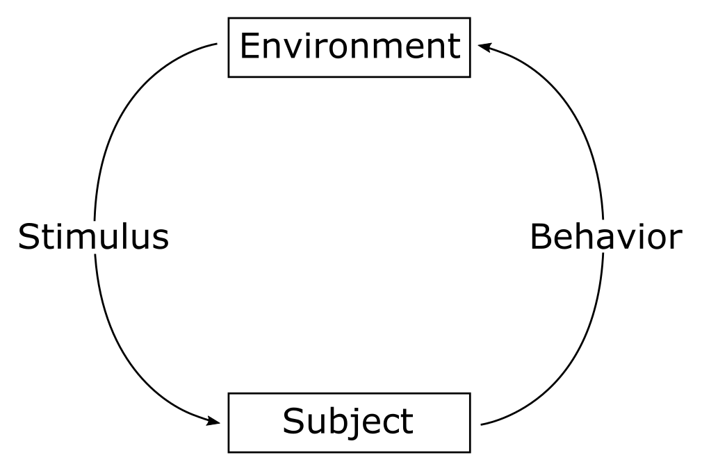

# Learning Simulator - A simulation software for animal and human learning

See also the [Learning Simulator Project](https://www.learningsimulator.org/) and the [Learning Simulator Documentation](https://learningsimulator.readthedocs.io/en/latest/).

## Build status

## Summary

Learning Simulator is a software for simulating learning in animals and humans, as studied for
example in experimental psychology and animal cognition research. It is primarily intended
for computational and behavioral biologists, ethologists, and psychologists, and it can also be
useful to students and teachers in these fields.

## Introduction

Learning Simulator was developed to study learning in animals and humans. The current
version implements associative learning (AL) and reinforcement learning (RL) algorithms, apt
to study instrumental (operant) learning and Pavlovian (classical) learning, including in
complex situations such as social learning or maze learning. A
plugin system to add more learning mechanisms is planned for a future version.

The simulator uses a commonly used framing of learning that comprises a subject interacting
with an environment. The environment presents a stimulus to the subject, and the subject
responds with a behavior. As a result, the environment presents the next stimulus that the
subject responds to, and so on. See Figure 1.

<!---

-->

**Figure 1: The subject and the world can be seen as two interacting dynamical systems, where the
state variables in the subject determine the probabilities for its behaviors (the subject’s output), and
each behavior from the subject puts the environment in a state that determines (probabilistically) its
output stimulus. It is this system that is simulated in Learning Simulator.**

The stimuli that the environment presents and the behaviors that the subject can exhibit
are pre-defined by the user of the program. Each stimulus is given a reinforcement value
(corresponding to genetically determined values in biological organisms). A stimulus such as
food would typically have a positive value, while the perception of harm to the body would
have a negative value.

As seen in Figure 1, the consequence of responding with a behavior (say *B*) to a stimulus (say *S*) is
that the subject meets the next stimulus (say *S'*):

*S* -> *B* -> *S'*.

Learning algorithms can then use the reinforcement value of *S'* as an indication of the quality
of the response *B* to *S*. Specifically, this can be accomplished by updating one or more
of the subject’s memory state variables. These state variables control the probabilities of
future responses: if the response *B* to stimulus *S* leads to a reward (a stimulus with high
reinforcement value), the subject will be more likely to respond with *B* the next time it faces
*S*.

The user of Learning Simulator specifies in a text script how the output stimulus from the
environment depends on the subject's response to the previous stimulus. This script also
specifies the values of all parameters used in the learning process. The simulation script,
written in a simple and well-documented scripting language, is the only input to Learning
Simulator, facilitating reproducible workflows. The script also specifies how to visualize the
simulation data, for example how a memory state variable changes during the simulation.
Learning Simulator can also export results to CSV files.
