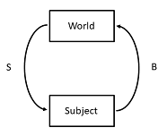

# Summary

*Learning Simulator* is a software for simulating learning phenomena governed by
associative learning. It is written in Python and can be run either in a graphical
user interface, or from a system command prompt. 
Our software is primarily targeted to computational and behavior biologists, ethologists,
and psychologists, however students/teachers who learn/teach learning phenomena may also
find it useful.

# Introduction

<!---
Associative learning is the ability of organisms to acquire knowledge about environmental contingencies between stimuli, responses, and outcomes
-->

Associative learning (AL) is the process by which a subject learns contingency
relations, either between pairs of stimuli (classical or Pavlovian conditioning),
or between stimulus-behavior pairs (operant or instrumental conditioning)
[@Pearce:2013; @Bouton:2016]. 

During the past few decades, a fair amount of research in
the field of AL has been directed toward the development
of mathematical models, *learning mechanisms*. As a result, there is a plethora
of mechanisms with varying properties and varying predictive power in
different environments.

<!--- Here we formalize associative learning experiments.-->
One formalization of AL that captures both classical and operant conditioning
comprises a subject that interacts with an environment.
The environment presents a stimulus to the subject, and the subject responds
with a behavior. As a result, the environment presents the next stimulus
that the subject responds to, and so on. See \autoref{fig:system-fig}.

The subject and the world can be seen as two interacting dynamical systems,
where the state variables in the subject determines the probabilities for
its responses (the subject's output), and each response from the subject puts the environment
in a state that determines its output stimulus. It is this system that is
simulated in Learning Simulator.

Each stimulus has a reinforcement value (which is genetically determined for
biological subjects). A rewarding stimulus (e.g. food) would typically have
positive value, while a stimulus representing harm to the body ("punishment")
would have a negative value.

As per the formalization in \autoref{fig:system-fig}, after the response $B$ to a stimulus $S$, the subject is presented with the next stimulus $S'$:
\begin{equation}
S \to B \to S'.
\end{equation}
Thus, as a consequence of responding with behavior $B$ to $S$, the subject meets
the stimulus $S'$.
<!---
This stimulus has a 
reinforcement value (typically a "reward" or "punishment") that the subject receives
-->
The reinforcement value of $S'$ gives the subject an indication of the quality of the response $B$ to $S$. 
This is accomplished by the learning mechanism updating one or more of
the subject's memory state
variables. In the case of operant conditioning, these include the associative strength between the stimulus $S$
and its response $B$. 
<!---
the behavior with which the subject responded.
-->
The values of these state variables control the
probabilities of future responses. For example, if the response $B$ to stimulus $S$
leads to a reward (a stimulus with high reinforcement value), the subject will be more likely to respond with $B$ the next
time it faces $S$.

The user of Learning Simulator specifies in a text-based script how the output
stimulus from the invironment depends on the subject's response to the previous stimulus.
<!---
Conversely, `Learning Simulator` also implements the stochastic decision
function that determines how the subject's response depends on the presented
stimulus.
-->
This script also specifies the values of all parameters used
in the learning process.
The simultion script, written in a simple and well-documented scripting language,
is the only input to Learning Simulator. In this language,
the user also specifies how to visualize the simulation data,
for example how a memory state variable changes over time during the simulation.
Learning Simulator also includes a functionality to export the results to a data processor spreadsheet.

# Applications of associative learning

Associative learning theory has a rich tradition of computational modeling.
During the last decade or so, AL has proven to be more powerful than earlier thought.

Firstly, AL mechanisms have been used in artificial intelligence (where the subject is
a virtual computer agent),
for example to teach computers to find optimal play and achieve human
level skills in chess [@Silver:2017] and the Chinese board game Go [@Silver:2016].

Secondly, behaving optimally (or near-optimally) is central to animals' adaptation
to their environment. Thus, AL can also provide explanations for a wide range of
learning phenomena in biological systems (both human and non-human
animals), for example misbehavior and genetic predispositions, and
social learning [@Enquist:2016], and the learning of behavior sequences
[@Ghirlanda:2017]. This fact also enables the possibility of generating
predictions of animal behavior.

Moreover, AL theory underpins some of the most successful applications
of psychology to animal welfare and training [@Mcgreevy:2011], and to
human health [@Bernstein:1999; @Haselgrove:2013; @Schachtman:2011].

The ability of AL algorithms to be able to search for optimal policies using
low-variance gradient estimates has made them useful in several other real-life
applications, such as robotics, power control, and finance [@Grondman:2012].

# Statement of need

The wide range of application areas and the various mechanisms
has given rise to a need
for a general simulation software for simulating different AL mechanisms.
The aim of our software is to fulfil this need.
The fast development of computing power has drastically improved the possibility
for this type of simulations.

Other simulating software either specialize in one particular
mechanism [@Schultheis:2008_1]  (Harris model), [@Alonso:2012]  (Rescorla-Wagner),
[@Schultheis:2008_2]  (only Rescorla-Wagner with compound stimuli),
or only includes models of classical conditioning [@Harris:2010; @learnSim; @Thorwart:2009] 
(where the latter is not maintained),
or where both the mechanism (Q-learning) and environment (maze) are hard-wired [https://www.mladdict.com/q-learning-simulator].

The present simulator includes
several mechanisms of AL in a common program environment.
Because of this, it further facilitates direct comparison of
the mechanisms included and allows the generation of meaningful
experiment designs and discrimination tasks.

The main advantage of our software lies in its flexibility. It is designed with \autoref{fig:system-fig}
in mind, seeing the system being simulated as two interacting dynamical systems,
making it generally applicable to the different areas where associative learning plays a role.

Apart from its flexibility, Learning Simulator's simple scripting language provides a way to easily investigate
the properties of different learning mechanisms and the effects of varying their properties, such as
exploration, learning rate coefficients, initial values of state variables, etc. 

Another strength of Learning Simulator lies in the simplicity to specify even complex
environments with which the subject interacts, for example an experiment trial structure. The scripting language has been
developed to be available to any researcher of learning phenomena -- not necessarily
computer programmers. This turns it into a useful research tool for biologists and
psychologists.

<!---
, which enables scientific exploration of learning phenomena by students
and experts alike.
-->

With this present software, opportunities for simulation
and assessment of associative learning models are easily available; in this
way, we hope that Learning Simulator will facilitate evaluating and
comparing different associative learning theories, thereby
helping gain a deeper understanding of the processes and
representations involved.

Our software has been
used in scientific publications [@Enquist:2016; @Lind:2018; @Lind:2019]
as well as in teaching, 
both at the Ethology Master's Programme at Stockholm University, and
at the Veterinary Programme at the Swedish University of Agricultural Sciences.

<!---
Our software can also potentially be applied to animal welfare in terms of experiment planning,
and understanding/avoiding stereotypic behavior,
as well as in clinical psychology in terms of planning of treatments for phobias, for example.

An open source license as well as its accessibility recommend `Learning Simulator` as a practical tool for biology, ethology, and
psychology students
enables scientific exploration of learning phenomena by students
and experts alike.
-->

An open source license as well as its accessibility enables further scientific exploration of learning phenomena by students
and experts alike within the fields of biology, ethology, and psychology.

The program is written in Python and its source code repository is hosted on GitHub. It uses the standard Python package `Tkinter` for its graphical user iterface, and `Matplotlib` [@Hunter:2007]
for plotting simulation results. The documentation is generated using Sphinx and hosted on Read the Docs.
In terms of quality assurance, test-driven development has been employed, and
our repository incorporates Travis CI alongside Coveralls code coverage measurement of the program's test suite.

# State of the field

<!---
 finding the balance between exploration and exploitation, time to convergence,
 been used in animal learning studies
 to explain flexible behavior in non-human animals.
 A wide range of learning phenomena
-->

<!---
# Citations

Citations to entries in paper.bib should be in
[rMarkdown](http://rmarkdown.rstudio.com/authoring_bibliographies_and_citations.html)
format.

If you want to cite a software repository URL (e.g. something on GitHub without a preferred
citation) then you can do it with the example BibTeX entry below for @fidgit.

For a quick reference, the following citation commands can be used:
- `@author:2001`  ->  "Author et al. (2001)"
- `[@author:2001]` -> "(Author et al., 2001)"
- `[@author1:2001; @author2:2001]` -> "(Author1 et al., 2001; Author2 et al., 2002)"
-->

# Road map

Making the software ever more readily available with a web interface.

Adding an alternative, even more easy-to-use (however less flexible) graphical user interface (GUI) to the scripting language.

Make it easier to add custom learning mechanisms.

# Acknowledgements

Financial support from Wallenberg:

The development work has been supported by grant XXXX.XXXX (2015.0005?) from the Knut and Alice Wallenberg Foundation.

We acknowledge valuable contributions from Vera Vinken during the development of this project.

# References
